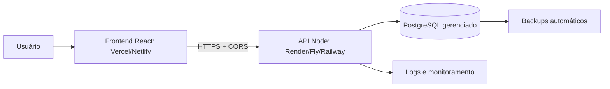

# StarTV

Aplicação de gerenciamento de clientes e dispositivos, preparada para múltiplos usuários.

```
star/
├── frontend/              # React + Vite: login, dashboard e migração
├── backend/               # Express + Prisma + PostgreSQL: API e autenticação
├── docs/                  # Regras e decisões do MVP
└── legacy/                # Protótipo vanilla preservado para referência
```

O código oficial é `frontend/` + `backend/`. A pasta `legacy/` não deve ser publicada nem usada em produção.

## Desenvolvimento local

Pré-requisitos: Node.js 20+, Docker Desktop e PostgreSQL via Docker.

### Banco

```powershell
cd backend
docker compose up -d
npx prisma migrate deploy
```

### API

```powershell
npm --prefix "C:\Users\User\Documents\star\backend" run dev
```

API: `http://localhost:3333`  
Saúde: `http://localhost:3333/health`

### React

```powershell
npm --prefix "C:\Users\User\Documents\star\frontend" run dev -- --host 127.0.0.1
```

Frontend: `http://127.0.0.1:5173`

## Testes e build

```powershell
npm --prefix "C:\Users\User\Documents\star\backend" test
npm --prefix "C:\Users\User\Documents\star\frontend" run build
```

## Deploy recomendado



- Frontend: Vercel, Netlify ou Nginx servindo `frontend/dist`.
- API: container Docker usando `backend/Dockerfile`.
- Banco: PostgreSQL gerenciado ou `backend/docker-compose.prod.yml` com volume persistente.
- Segredos: variáveis de ambiente do provedor, nunca commitados.
- Migrações: `npx prisma migrate deploy` antes de liberar a nova API.
- Backups: rotina diária usando `backend/scripts/backup.ps1` ou o recurso nativo do provedor.
- Monitoramento: `GET /health`, logs JSON e alertas de indisponibilidade.

Instruções detalhadas estão em [backend/DEPLOY.md](backend/DEPLOY.md).

## Deploy com Vercel + Render

O arquivo [render.yaml](render.yaml) já descreve a API no Render e o PostgreSQL gerenciado. O frontend deve ser conectado separadamente à Vercel usando `frontend/` como diretório raiz.

### Ordem de publicação

1. Suba o repositório para o GitHub sem enviar `.env`, backups ou `node_modules`.
2. No Render, crie um Blueprint apontando para `render.yaml`.
3. Aguarde o banco e a API. A URL ficará parecida com `https://startv-api.onrender.com`.
4. No Render, defina `CORS_ORIGIN` temporariamente com a URL que a Vercel fornecerá.
5. Na Vercel, importe o mesmo repositório e defina **Root Directory** como `frontend`.
6. Use o build `npm run build` e o output `dist`.
7. Crie na Vercel a variável `VITE_API_URL` com `https://startv-api.onrender.com/api`.
8. Faça o deploy da Vercel e copie o domínio final, por exemplo `https://startv.vercel.app`.
9. Volte ao Render e altere `CORS_ORIGIN` para o domínio final da Vercel. Separe múltiplas origens por vírgula quando necessário.
10. Faça um novo deploy/restart da API e teste cadastro, login, criação de cliente e logout.

### Variáveis

No Render:

```text
DATABASE_URL        # criada pelo PostgreSQL do Blueprint
JWT_SECRET          # gerada pelo Render
CORS_ORIGIN         # https://seu-projeto.vercel.app
NODE_ENV=production
```

Na Vercel:

```text
VITE_API_URL=https://sua-api.onrender.com/api
```

O `frontend/vercel.json` já configura o fallback para `index.html`, necessário para rotas do React.

## Variáveis de produção

API: `DATABASE_URL`, `JWT_SECRET`, `CORS_ORIGIN`, `POSTGRES_USER`, `POSTGRES_PASSWORD`, `POSTGRES_DB`.

Frontend:

```text
VITE_API_URL=https://api.seu-dominio.com/api
```

## Especificação do MVP

As entidades, regras de negócio, permissões, critérios de aceite e contratos iniciais da API estão documentados em [docs/mvp-regras.md](docs/mvp-regras.md).

Esse documento deve ser tratado como referência antes da criação do backend e do banco PostgreSQL.

## Estado atual

- Autenticação com bcrypt, JWT e refresh token rotativo.
- CRUD de clientes e múltiplos dispositivos.
- Busca, filtros e paginação no servidor.
- Migração do `localStorage` legado com backup preservado.
- Testes automatizados da API.
